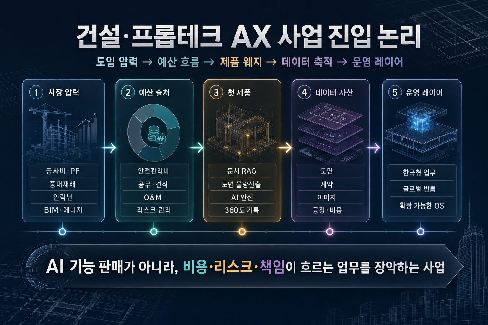

# 종합 분석: 건설·프롭테크 AX, 뛰어들 만한 사업인가

> 이 문서는 특정 투자 결론을 강요하기 위한 자료가 아니다. **우리가 건설·프롭테크 AX 영역에 제품·사업·포지셔닝 관점에서 들어갈 충분한 이유가 있는지**를 판단하기 위해 13개 리서치를 하나의 사업 진입 논리로 재구성한 종합 분석이다.

## 한 장으로 보는 판단

건설·프롭테크 AX의 핵심은 “AI 기능을 붙이는 것”이 아니다. 더 정확히는 **이미 돈이 새고 있고, 책임이 커지고 있으며, 데이터는 쌓이지만 연결되지 않는 업무 흐름에 들어가 반복 업무와 의사결정 데이터를 장악하는 것**이다.

건설·프롭테크 AX 사업 진입 논리: 도입 압력, 예산 흐름, 첫 제품 웨지, 데이터 자산, 운영 레이어 포지셔닝을 하나의 흐름으로 정리

| 핵심 질문 | 현재 판단 | 왜 중요한가 |
| --- | --- | --- |
| 지금 들어갈 이유가 있는가 | 있다. 공사비·PF·중대재해·인력난·BIM/ZEB·에너지 비용이 동시에 압박한다. | 고객이 “AI가 좋아서”가 아니라 “기존 방식으로는 버티기 어려워서” 도입을 검토한다. |
| 돈은 어디서 나오는가 | 별도 AI 예산보다 안전관리비, 공무·견적 인건비, O&M/전기료, 리스크 관리비에서 나온다. | 예산 출처가 명확해야 PoC가 실험으로 끝나지 않고 구매로 이어진다. |
| 첫 제품은 무엇이어야 하는가 | 전사 플랫폼이 아니라 6~12주 안에 시간·비용·리스크 지표를 증명하는 좁은 웨지여야 한다. | 보수적인 산업에서는 큰 비전보다 작은 업무의 확실한 성과가 신뢰를 만든다. |
| 장기적으로 커질 수 있는가 | 가능하다. 문서·도면·사진·공정·비용·에너지 데이터가 쌓이면 운영 레이어로 확장된다. | 단순 자동화 도구가 아니라 고객의 업무 기록과 판단 기준이 될 수 있다. |
| 우리가 잡을 포지션은 어디인가 | 글로벌 플랫폼과 대기업 내재화가 깊게 커버하지 못하는 한국형 업무·책임·정산 흐름이다. | 한국어 문서, 공무 관행, 하도급, 안전 규제, PF/정산은 현지화 깊이가 필요하다. |

<strong>리서치 인용</strong> — <a href="./korea-why-now-research">한국, 왜 지금인가</a>, <a href="./budget-owner-buying-motion">예산 주체와 구매 여정</a>, <a href="./wedge-ranking">웨지 랭킹</a>, <a href="./competitive-white-space-research">경쟁 공백 영역</a>, <a href="./ax-operating-layer-thesis">AX 운영 레이어 논리</a>

## 1. 사업 진입의 본질: “AI 도구”가 아니라 “업무 장악”

이 시장을 얕게 보면 “건설은 보수적이니 AI 도입이 느릴 것”이라는 결론이 나온다. 하지만 실제 질문은 다르다. **보수적인 산업일수록 한번 핵심 업무 흐름에 들어간 도구는 잘 빠지지 않는다.** 따라서 건설·프롭테크 AX의 기회는 “새로운 AI 기능”이 아니라 다음 세 가지를 동시에 만족하는 업무를 찾는 데 있다.

1. **고통이 이미 예산 언어로 표현된다.** 사고, 재작업, 입찰 지연, 클레임, 전기료, 공실, PF 리스크처럼 돈으로 환산된다.
2. **데이터가 이미 존재한다.** 도면, 계약서, RFI, 사진, CCTV, 공정표, BMS, 임대/공실 데이터가 흩어져 있을 뿐이다.
3. **반복 업무가 명확하다.** 사람이 계속 읽고, 비교하고, 확인하고, 보고하고, 증빙하는 업무가 많다.

이 세 조건이 겹치는 곳에서는 AI가 “멋진 기능”이 아니라 **업무 처리 비용을 낮추고 책임 증빙을 자동화하는 운영 인프라**가 된다.

<strong>리서치 인용</strong> — <a href="./construction-workflow-map">건설 워크플로우 AX 적용처 지도</a>, <a href="./roi-proof-bank">ROI Proof Bank — 상세 사례</a>

## 2. 왜 지금인가: 압력이 한 방향으로 겹친다

한국 건설·부동산 시장은 단일한 기술 유행 때문에 움직이는 것이 아니다. 여러 압력이 동시에 쌓이면서 “기존 방식의 비용”이 커지고 있다.

| 압력 | 현장에서 생기는 문제 | AX가 들어갈 수 있는 이유 |
| --- | --- | --- |
| 공사비 상승 | 견적 오차, 자재비 변동, 원가 초과가 곧바로 손실로 연결 | 도면 물량산출, 원가 예측, 조달 비교, 설계변경 영향 분석 |
| PF 구조 재편 | 사업성 검토, 담보가치, 공실·임대 리스크 판단의 정확도가 중요 | CRE/PF 데이터 분석, 비주택 AVM, 사업성 자동 검토 |
| 중대재해 책임 | 사고가 경영진 책임과 공사 중단 리스크로 확대 | AI 안전 모니터링, 위험 행동 감지, 안전 증빙 자동화 |
| 인력난·고령화 | 현장·공무·견적 인력이 줄고, 숙련자 의존도가 커짐 | RFI/계약 RAG, 보고서 자동화, 현장 기록 자동화 |
| BIM·ZEB·에너지 규제 | 설계·시공·운영 데이터의 정밀한 관리 필요 | BIM 검측, AI HVAC, O&M 최적화, 에너지 리포팅 |

여기서 중요한 점은 압력이 서로 분리되어 있지 않다는 것이다. 공사비 상승은 견적 자동화 수요를 만들고, PF 리스크는 사업성 데이터 수요를 만들며, 중대재해 책임은 현장 영상·증빙 데이터를 요구한다. 이 데이터들이 연결되면 단일 기능을 넘어 **프로젝트 운영의 판단 레이어**로 커질 수 있다.

<strong>리서치 인용</strong> — <a href="./korea-why-now-research">한국, 왜 지금인가</a>, <a href="./proptech-money-map">프롭테크 Money Map</a>

## 3. 돈은 “AI 예산”이 아니라 기존 비용 항목에서 나온다

AX 상품을 “AI 솔루션”으로 팔면 고객 내부에서 새로운 예산을 만들어야 한다. 반대로 이미 존재하는 비용 항목에 붙이면 구매 논리가 훨씬 명확해진다.

| 예산 풀 | 실제 구매자 | 팔 수 있는 제품 | 구매자가 보는 숫자 |
| --- | --- | --- | --- |
| 안전·컴플라이언스 | CSO, 안전보건실, 현장소장 | AI CCTV, PPE 감지, 위험 행동 감지, 자동 리포트 | 사고 예방, 작업중지 리스크 감소, 증빙 자동화 |
| 공무·견적·계약 | 공무팀장, 견적팀장, 법무·구매 | 도면 takeoff, 계약/RFI RAG, 설계변경 증빙 검색 | 작업 시간 절감, 입찰 처리량 증가, 클레임 리스크 감소 |
| O&M·에너지 | PM/FM, 자산운용사, 건물주 | AI HVAC, 예지보전, 운영 대시보드 | 전기료 절감, NOI 개선, 설비 장애 감소 |
| CRE·PF 데이터 | 은행, 증권사, 운용사, 시행사 | 비주택 AVM, 사업성 검토, 임대/공실 데이터 | 투자 오판 방지, 담보가치 오류 감소, 심사 속도 개선 |
| 임대·입주자 운영 | 임대사업자, PM사, 운영사 | 24/7 임대 응대, AS 접수 AI, 리드 관리 | 공실 손실 감소, 콜센터 비용 절감, 응답률 개선 |

따라서 GTM의 출발점은 “AI로 무엇을 할 수 있나”가 아니라 **“어느 부서의 어떤 비용을 줄이고, 어떤 책임을 낮추며, 어떤 지표를 90일 안에 증명할 수 있나”**여야 한다.

<strong>리서치 인용</strong> — <a href="./budget-owner-buying-motion">예산 주체와 구매 여정</a>, <a href="./roi-proof-bank">ROI Proof Bank — 상세 사례</a>, <a href="./ax-positioning-pricing-gtm">AX 포지셔닝·가격·GTM</a>

## 4. 첫 제품 웨지: 넓게 시작하지 말고 깊게 들어간다

건설·부동산 조직은 전사 플랫폼 교체를 쉽게 하지 않는다. 하지만 특정 업무가 너무 불편하고, 기존 데이터를 활용할 수 있으며, 결과가 빨리 보이면 제한된 PoC는 가능하다. 이 시장의 첫 제품은 다음 기준을 통과해야 한다.

| 기준 | 좋은 웨지 | 나쁜 웨지 |
| --- | --- | --- |
| 데이터 접근성 | 고객이 이미 가진 PDF, CAD, 계약서, CCTV, BMS 데이터로 시작 | 신규 센서·시스템·ERP 통합이 먼저 필요한 것 |
| 성과 측정 | 시간, 오류, 비용, 리스크 감소가 6~12주 안에 보임 | 효과가 추상적이거나 장기 전략으로만 설명됨 |
| 구매 명분 | 기존 예산 항목과 연결됨 | “혁신”, “AI 도입” 같은 모호한 명분에 의존 |
| 확장성 | 인접 문서·도면·공정·비용 데이터로 확장 | 한 번 쓰고 끝나는 단발성 자동화 |
| 현장 마찰 | 기존 업무 위에 얹히고 교육 부담이 작음 | 현장 행동을 크게 바꾸거나 데이터 입력을 강요 |

### 우선 검토할 웨지 후보

| 우선순위 | 웨지 | 왜 먼저인가 | 확장 방향 |
| --- | --- | --- | --- |
| 1 | 계약/RFI/클레임 문서 RAG | 기존 문서가 이미 있고, “판단 대체”가 아니라 검색·요약·근거 찾기라 도입 장벽이 낮다. | 공무 자동화, 설계변경 리스크 관리, 클레임 방어 |
| 1 | 2D 도면 기반 물량산출·견적 자동화 | PDF/CAD 도면이 이미 있고, 수작업 시간이 명확하며 결과 검증이 쉽다. | 견적 DB, 자재 조달, 입찰 자동화 |
| 1 | AI 안전 모니터링 | 규제와 사고 리스크가 강한 구매 명분을 만들고, 현장 데이터가 계속 쌓인다. | 보험·브로커 제휴, 안전 점수, 현장 리스크 플랫폼 |
| 2 | 360도 현장 기록·진척도 추적 | 본사-현장 정보 비대칭과 분쟁 증빙 문제를 해결한다. | BIM 비교, 품질 검측, 공정 리스크 예측 |
| 2 | AI HVAC/O&M | 전기료 절감이 NOI와 직접 연결된다. | 예지보전, ESG 리포팅, 포트폴리오 운영 |
| 전략 | CRE/PF 리스크 분석 | 금융권·시행사 의사결정의 오류 비용이 크다. | AVM, 담보, 임대·공실, 심사 자동화 |

이 중 어디를 먼저 잡을지는 네트워크 접근성에 달려 있다. 건설사 C-level 접근이 강하면 문서/RFI·견적·안전이 빠르고, 자산운용/부동산 네트워크가 강하면 O&M·CRE/PF 데이터가 유리하다.

<strong>리서치 인용</strong> — <a href="./wedge-ranking">웨지 랭킹</a>, <a href="./construction-workflow-map">건설 워크플로우 AX 적용처 지도</a>, <a href="./proptech-money-map">프롭테크 Money Map</a>

## 5. 포지셔닝: “플랫폼 대체”가 아니라 “한국형 업무 레이어”

이미 강한 플레이어는 있다. Autodesk, Procore, Trimble, Bentley 같은 글로벌 플랫폼은 프로젝트 관리·BIM·문서·협업의 큰 축을 장악하고 있다. 국내 대형 건설사도 자체 AI 도구를 만든다. 그래서 정면승부는 좋은 전략이 아니다.

우리가 봐야 할 위치는 다음과 같다.

| 경쟁 축 | 강점 | 우리가 들어갈 빈틈 |
| --- | --- | --- |
| 글로벌 플랫폼 | 표준화된 기능, 글로벌 생태계, 대기업 레퍼런스 | 한국어 공무 문서, 하도급 관행, 안전 규제, PF·정산·클레임의 깊은 현지화 |
| 국내 대형 건설사 자체 개발 | 내부 데이터, 현장 접근성, 예산 | 외부 판매, 중견/중소 시장 확장, 빠른 제품 반복, 범용화 역량 |
| 기존 SI/ERP | 고객 관계, 구축 경험, 시스템 통합 | AI 네이티브 UX, 빠른 PoC, 데이터 기반 자동화, 반복형 SaaS 제품화 |
| 신규 AX 팀 | 특정 업무에 빠르게 집중 가능, 최신 AI 활용 | 초기 신뢰, 레퍼런스, 데이터 접근권 확보 필요 |

따라서 포지셔닝 문장은 이렇게 잡는 것이 맞다.

<strong>한국형 건설·부동산 업무의 비용·책임·데이터 흐름에 들어가는 AX 운영 레이어</strong>

이 표현은 투자만을 겨냥하지 않는다. 제품 전략, GTM, 파트너십, 채널, 장기 데이터 해자를 모두 설명한다.

<strong>리서치 인용</strong> — <a href="./competitive-white-space-research">경쟁 공백 영역</a>, <a href="./korea-domestic-cases">국내 건설사·프롭테크 사례</a>, <a href="./global-enterprise-cases">글로벌 대기업·엔터프라이즈 사례</a>

## 6. 운영 레이어로 확장되는 경로

첫 제품이 작아 보여도 괜찮다. 문제는 그것이 어떤 데이터를 잡고, 고객의 어느 반복 의사결정으로 확장되는가다.

| 시작 제품 | 처음 해결하는 문제 | 축적되는 데이터 | 다음 확장 | 장기 포지션 |
| --- | --- | --- | --- | --- |
| 도면 물량산출 | 견적 시간과 오류 | 도면, 수량, 단가, 견적 이력 | 자재 조달, 입찰, 원가 예측 | 비용 의사결정 레이어 |
| 계약/RFI RAG | 문서 검색·근거 확인 | 계약, 질의, 설계변경, 클레임 | 공무 자동화, 리스크 예측 | 문서·책임 레이어 |
| AI 안전 모니터링 | 위험 행동·증빙 | 현장 영상, near-miss, 작업자/공정 맥락 | 보험, 안전 점수, 교육 | 현장 리스크 레이어 |
| 360도 현장 기록 | 진척·품질 확인 | 이미지, 위치, 공정, BIM 비교 | 공정 예측, 품질 검측 | 현장 운영 레이어 |
| AI HVAC/O&M | 전기료·설비 운영 | 설비, 에너지, 수리, SLA | 예지보전, ESG, NOI 개선 | 자산 운영 레이어 |
| CRE/PF 분석 | 사업성·담보 판단 | 임대, 공실, 거래, 금융 조건 | AVM, 심사 자동화 | 자본시장 의사결정 레이어 |

운영 레이어의 조건은 세 가지다.

1. **매일 또는 매주 반복 사용된다.**
2. **업무 결과가 고객 내부 의사결정과 보고에 쓰인다.**
3. **쌓인 데이터가 다음 업무 자동화의 입력이 된다.**

이 조건을 충족하면 첫 제품은 단순 SaaS가 아니라 고객 업무의 기준점이 된다.

<strong>리서치 인용</strong> — <a href="./ax-operating-layer-thesis">AX 운영 레이어 논리</a>, <a href="./sme-startup-project-cases">중소기업·스타트업·프로젝트 단위 사례</a>

## 7. 90일 검증 시나리오

이 사업은 긴 전략 문서보다 빠른 검증 설계가 중요하다. 다음 순서로 보면 “뛰어들 만한가”를 현실적으로 판단할 수 있다.

| 기간 | 목표 | 해야 할 일 | 판단 기준 |
| --- | --- | --- | --- |
| 0~2주 | 고객 고통 확인 | 고객군 10곳 인터뷰, 기존 문서·도면·데이터 샘플 확보, 예산 소유자 확인 | 고통이 명확하고 예산 소유자가 있는가 |
| 3~6주 | PoC 설계 | 하나의 현장/자산/문서군에서 baseline 설정, 성과 지표 합의 | 시간·비용·리스크 지표가 숫자로 잡히는가 |
| 7~12주 | 첫 검증 | 실제 업무에 적용, 결과 리포트 생성, 담당자 피드백 반영 | 재사용 의사가 있는가, 내부 공유 가능한 성과가 있는가 |
| 3~6개월 | 확장 | 인접 workflow 연결, 가격 모델 테스트, 보안·권한·감사 로그 정비 | 팀/현장/자산 단위 확장이 가능한가 |
| 6~12개월 | 포지션 확립 | 특정 버티컬에서 레퍼런스 확보, 파트너·채널 구축 | “이 업무는 이 팀이 제일 잘한다”는 인식이 생기는가 |

핵심은 “제품을 만들고 팔아보자”가 아니라 **구매자가 이미 쓰는 비용과 리스크 지표 위에서 검증하는 것**이다.

<strong>리서치 인용</strong> — <a href="./ax-positioning-pricing-gtm">AX 포지셔닝·가격·GTM</a>, <a href="./investor-thesis-market-map">시장 진입 논리·시장 지도</a>

## 8. 반론과 리스크

이 시장은 매력적이지만 쉬운 시장은 아니다. 오히려 다음 리스크를 정면으로 보고 들어가야 한다.

| 반론 | 실제 의미 | 대응 방식 |
| --- | --- | --- |
| 건설사는 보수적이다 | 전사 시스템 교체는 어렵다 | 기존 업무 위에 얹히는 좁은 PoC로 시작한다. |
| 데이터가 지저분하다 | 범용 AI만으로는 성능이 안 나온다 | 문서·도면·현장 데이터의 전처리/권한/감사 로그를 제품 핵심으로 본다. |
| 대기업이 직접 만들 수 있다 | 대형사 내부 문제는 자체 개발 가능성이 있다 | 중견·중소·프로젝트·외부 파트너 시장과 한국형 업무 깊이를 노린다. |
| 글로벌 플랫폼이 들어올 수 있다 | 범용 기능은 빠르게 commoditize된다 | 한국어 공무 문서, 하도급, 안전, PF/정산 같은 현지 업무 맥락을 깊게 잡는다. |
| PoC만 하고 구매가 안 될 수 있다 | 혁신 예산형 PoC는 실패 가능성이 크다 | 처음부터 예산 소유자와 성과 지표를 합의하고, 기존 비용 항목에 연결한다. |

즉, 성공 조건은 기술 과시가 아니라 **고객 업무 맥락, 구매 명분, 데이터 접근권, 반복 사용성**이다.

## 9. 종합 판단

건설·프롭테크 AX는 “당장 큰 플랫폼을 만들 수 있다”는 식의 단순한 기회가 아니다. 하지만 특정 업무에서 시작해 비용·리스크·책임 흐름을 장악하고, 그 결과 데이터와 의사결정을 축적한다면 충분히 뛰어들 만한 구조가 있다.

최종 판단은 다음과 같다.

<strong>건설·프롭테크 AX의 기회는 AI 기능 판매가 아니라, 이미 존재하는 비용·리스크·책임 흐름에 들어가 고객의 반복 업무와 데이터를 장악하고, 이를 한국형 운영 레이어로 확장하는 데 있다.</strong>

따라서 이 사업은 다음 조건을 만족할 때 진입 가치가 있다.

1. **첫 고객군과 예산 소유자가 명확하다.**
2. **90일 안에 시간·비용·리스크 지표를 증명할 수 있다.**
3. **첫 제품이 인접 데이터와 업무로 확장된다.**
4. **글로벌 플랫폼이 깊게 처리하지 못하는 한국형 업무 맥락을 잡는다.**
5. **단발성 자동화가 아니라 운영 레이어로 커지는 데이터 경로가 있다.**

## 참고한 리서치 데이터

| 리서치 | 종합 분석에서 활용한 역할 |
| --- | --- |
| [웨지 랭킹](./wedge-ranking) | 첫 제품 후보와 우선순위 판단 |
| [예산 주체와 구매 여정](./budget-owner-buying-motion) | 실제 구매자·예산·영업 흐름 확인 |
| [한국, 왜 지금인가](./korea-why-now-research) | 한국 시장의 타이밍과 도입 압력 확인 |
| [경쟁 공백 영역](./competitive-white-space-research) | 글로벌/국내 플레이어 사이의 포지셔닝 빈틈 확인 |
| [AX 운영 레이어 논리](./ax-operating-layer-thesis) | 포인트 솔루션에서 운영 레이어로 확장되는 논리 확인 |
| [글로벌 대기업·엔터프라이즈 사례](./global-enterprise-cases) | 글로벌 ROI와 엔터프라이즈 적용 사례 확인 |
| [국내 건설사·프롭테크 사례](./korea-domestic-cases) | 국내 구매자·데이터·레퍼런스 확인 |
| [중소기업·스타트업·프로젝트 단위 사례](./sme-startup-project-cases) | 초기 기업과 프로젝트 단위 적용 가능성 확인 |
| [ROI Proof Bank — 상세 사례](./roi-proof-bank) | 정량 성과와 ROI 근거 확인 |
| [건설 워크플로우 AX 적용처 지도](./construction-workflow-map) | 가치사슬별 적용처와 마찰도 확인 |
| [프롭테크 Money Map](./proptech-money-map) | 예산 풀과 수익 풀 확인 |
| [AX 포지셔닝·가격·GTM](./ax-positioning-pricing-gtm) | 가격·PoC·GTM 설계 확인 |
| [시장 진입 논리·시장 지도](./investor-thesis-market-map) | 시장 지도와 실행 로드맵 확인 |

GPT-5.5가 주도하여 Google Gemini Deep Research Agent Max 8개를 병렬로 실행하고, 각 결과를 종합·재구성하여 정리하였습니다. 이후 추가 리서치 5개를 함께 반영해 사업 진입·제품·포지셔닝 관점의 종합 분석을 확장했습니다.

