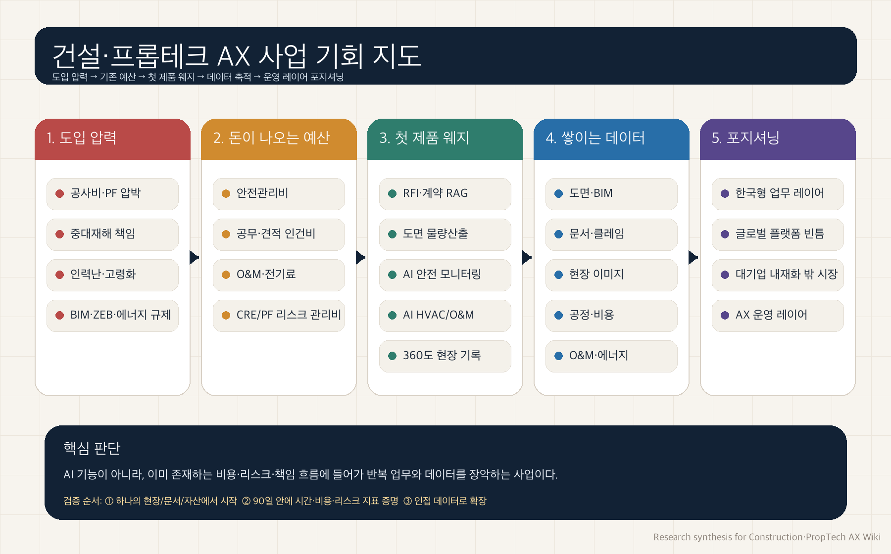

# 종합 분석: 건설·프롭테크 AX, 뛰어들 만한 사업인가

> 이 문서는 “투자를 위한 결론”만을 내리는 자료가 아니라, **제품·시장·포지셔닝 관점에서 건설·프롭테크 AX 사업에 뛰어들 만한 이유가 있는지**를 판단하기 위한 종합 분석이다.

## 한 장으로 보는 결론

건설·프롭테크 AX는 단순히 “낙후된 산업에 AI를 붙이는” 이야기가 아니다. 더 정확하게는 **이미 돈이 새고 있는 업무, 이미 책임이 커진 업무, 이미 데이터가 쌓이고 있지만 연결되지 않은 업무**에 AI 운영 레이어를 얹는 사업 기회다.

건설·프롭테크 AX 사업 기회 지도: 도입 압력, 예산, 제품 웨지, 데이터 확장, 포지셔닝을 하나의 흐름으로 정리

핵심 판단은 다음과 같다.

| 질문 | 판단 |
| --- | --- |
| 지금 시장에 들어갈 이유가 있는가 | 있다. 공사비, PF, 인력난, 중대재해, BIM·에너지 규제가 동시에 압력을 만들고 있다. |
| 누가 돈을 내는가 | 혁신 예산이 아니라 안전비, 공무·견적 인건비, O&M/에너지 비용, 금융 리스크 관리비에서 나온다. |
| 무엇부터 팔아야 하는가 | 전사 플랫폼이 아니라 6~12주 안에 효과가 보이는 좁은 업무 웨지부터 시작해야 한다. |
| 장기적으로 커질 수 있는가 | 가능하다. 웨지가 도면·문서·사진·일정·비용·운영 데이터를 축적하면 운영 레이어로 확장된다. |
| 우리의 포지셔닝은 어디인가 | 글로벌 플랫폼이 깊게 못 들어오고, 대기업 내재화가 중소·중견·프로젝트 시장을 다 커버하지 못하는 한국형 업무 빈틈이다. |

## 왜 “투자”보다 “사업 진입” 관점으로 봐야 하는가

이 시장을 단순 투자 테마로만 보면 “건설은 느리다”, “현장은 보수적이다”, “대기업이 직접 만들 것이다”라는 반론에 쉽게 막힌다. 그러나 제품·시장·포지셔닝 관점으로 보면 질문이 달라진다.

* **제품 관점:** 어떤 업무는 이미 고통이 크고, 데이터가 존재하며, 자동화 효과가 숫자로 보인다.
* **시장 관점:** 구매자는 AI를 사고 싶은 것이 아니라 비용 절감, 사고 예방, 공기 단축, 문서 리스크 감소, 에너지 절감을 사고 싶다.
* **포지셔닝 관점:** 글로벌 범용 플랫폼과 국내 대기업 자체 개발 사이에 한국어 문서·공무 관행·하도급·안전·PF·정산에 특화된 빈틈이 있다.
* **확장 관점:** 하나의 업무에서 시작해 인접 데이터와 의사결정을 연결하면 운영 레이어가 된다.

즉, 결론은 “무조건 투자해야 한다”가 아니라 **검증 가능한 첫 업무를 잡으면 제품화·사업화·포지셔닝 모두에서 시도해볼 만한 구조가 있다**는 것이다.

<strong>리서치 인용</strong> — <a href="./korea-why-now-research">한국, 왜 지금인가</a>는 한국 시장의 도입 압력을, <a href="./budget-owner-buying-motion">예산 주체와 구매 여정</a>은 실제 예산 출처를, <a href="./competitive-white-space-research">경쟁 공백 영역</a>은 포지셔닝의 빈틈을 뒷받침한다.

## 시장 압력: 왜 지금인가

한국 건설·부동산 시장은 여러 압력이 동시에 겹쳐 있다.

| 압력 | 현장에서 생기는 문제 | AX 기회 |
| --- | --- | --- |
| 공사비 상승 | 견적 오차와 원가 초과가 치명적 | 도면 물량산출, 원가 예측, 조달 자동화 |
| PF 구조 재편 | 사업성·담보·공실 리스크 판단이 중요 | CRE/PF 데이터 분석, 사업성 자동 검토 |
| 중대재해처벌법 | 사고 리스크가 경영진 책임으로 올라감 | AI 안전 모니터링, 위험 행동 감지, 증빙 자동화 |
| 인력 고령화·부족 | 현장·공무·견적 업무 병목 심화 | RFI/계약 RAG, 보고서 자동화, 현장 기록 자동화 |
| BIM·ZEB·에너지 규제 | 설계·운영 데이터의 디지털화 필요 | BIM 품질 검측, AI HVAC, O&M 최적화 |

이 압력들은 “있으면 좋은 혁신”이 아니라 기존 업무 방식의 한계를 만든다. AX가 들어갈 수 있는 이유는 여기에 있다.

<strong>리서치 인용</strong> — <a href="./korea-why-now-research">한국, 왜 지금인가</a>, <a href="./construction-workflow-map">건설 워크플로우 AX 적용처 지도</a>, <a href="./proptech-money-map">프롭테크 Money Map</a>

## 돈은 어디서 나오는가

AX 상품은 “AI 예산”으로 팔기 어렵다. 반대로 이미 존재하는 예산 항목에 붙이면 훨씬 명확해진다.

| 예산 풀 | 구매자 | 팔 수 있는 제품 | 구매자가 보는 숫자 |
| --- | --- | --- | --- |
| 안전·컴플라이언스 | CSO, 안전보건실, 현장소장 | AI CCTV, PPE 감지, 위험행동 감지, 자동 리포트 | 사고 예방, 작업중지 리스크 감소, 증빙 자동화 |
| 공무·견적·계약 | 공무팀장, 견적팀장, 법무·구매 | 도면 takeoff, 계약/RFI RAG, 설계변경 증빙 검색 | 작업 시간 절감, 입찰 처리량 증가, 클레임 리스크 감소 |
| O&M·에너지 | PM/FM, 자산운용사, 건물주 | AI HVAC, 예지보전, 운영 대시보드 | 전기료 절감, NOI 개선, 설비 장애 감소 |
| CRE·PF 데이터 | 은행, 증권사, 운용사, 시행사 | 비주택 AVM, 사업성 검토, 임대/공실 데이터 | 투자 오판 방지, 담보가치 오류 감소, 심사 속도 개선 |
| 임대·입주자 운영 | 임대사업자, PM사, 운영사 | 24/7 임대 응대, AS 접수 AI, 리드 관리 | 공실 손실 감소, 콜센터 비용 절감, 응답률 개선 |

이 표의 의미는 명확하다. 사업은 “AI를 사주세요”가 아니라 “이미 쓰고 있는 비용과 리스크를 줄여드립니다”로 설계되어야 한다.

<strong>리서치 인용</strong> — <a href="./budget-owner-buying-motion">예산 주체와 구매 여정</a>, <a href="./roi-proof-bank">ROI Proof Bank — 상세 사례</a>

## 무엇부터 시작해야 하는가: 첫 웨지

처음부터 전사 플랫폼을 만들면 도입 마찰이 너무 크다. 반대로 하나의 현장, 하나의 문서군, 하나의 자산, 하나의 비용 항목에서 시작하면 검증 가능성이 높아진다.

| 우선순위 | 웨지 | 왜 먼저인가 | 확장 방향 |
| --- | --- | --- | --- |
| 1 | 계약/RFI/클레임 문서 RAG | 기존 문서가 이미 있고, 법무 대체가 아니라 검색·요약·근거 찾기라 도입 장벽이 낮다 | 공무 자동화, 설계변경 리스크 관리, 클레임 방어 |
| 1 | 2D 도면 기반 물량산출·견적 자동화 | PDF/CAD 데이터가 이미 있고, 수작업 시간이 명확하다 | 견적 DB, 자재 조달, 입찰 자동화 |
| 1 | AI 안전 모니터링 | 규제와 사고 리스크가 강한 구매 명분을 만든다 | 보험·브로커 제휴, 현장 안전 플랫폼 |
| 2 | AI HVAC/O&M | 전기료 절감이 NOI와 직접 연결된다 | 예지보전, ESG 리포팅, 포트폴리오 운영 |
| 2 | 360도 현장 기록·진척도 추적 | 본사-현장 정보 비대칭과 분쟁 증빙 문제를 해결한다 | BIM 비교, 품질 검측, 공정 리스크 예측 |
| 전략 | CRE/PF 리스크 분석 | 금융권·시행사 의사결정의 오류 비용이 크다 | AVM, 담보, 임대·공실, 투자심사 자동화 |

첫 제품은 “우리가 만들고 싶은 것”이 아니라 “고객이 90일 안에 효과를 확인할 수 있는 것”이어야 한다.

<strong>리서치 인용</strong> — <a href="./wedge-ranking">웨지 랭킹</a>, <a href="./ax-positioning-pricing-gtm">AX 포지셔닝·가격·GTM</a>

## 경쟁 공백: 우리가 서야 할 위치

이 시장에는 이미 강한 플레이어가 있다. Autodesk, Procore, Trimble, Bentley 같은 글로벌 플랫폼은 프로젝트 관리·BIM·문서·협업의 큰 축을 장악하고 있다. 국내 대형 건설사도 자체 AI 도구를 만든다. 그렇다면 빈틈은 어디인가?

| 플레이어 | 강점 | 빈틈 |
| --- | --- | --- |
| 글로벌 플랫폼 | 표준화된 엔터프라이즈 기능, 대규모 생태계 | 한국어 공무 문서, 하도급, 안전 규제, PF·정산 관행의 깊은 현지화 부족 |
| 국내 대형 건설사 자체 개발 | 내부 데이터와 현장 접근성 | 외부 판매·중소/중견 시장 확장, 범용 제품화, 빠른 실험 속도 제한 |
| 기존 국내 SI/ERP | 고객 관계와 구축 경험 | AI 네이티브 UX, 빠른 PoC, 현장 데이터 기반 자동화 역량 부족 |
| 신규 AX 팀 | 특정 업무에 빠르게 집중 가능 | 레퍼런스·신뢰·데이터 접근권 확보가 초기 병목 |

따라서 포지셔닝은 “글로벌 플랫폼을 대체한다”가 아니라 **한국형 현장·문서·책임 흐름에 깊게 들어가는 AX 레이어**가 되어야 한다. 작은 기능이더라도 고객의 핵심 업무와 증빙 흐름에 들어가면 방어력이 생긴다.

<strong>리서치 인용</strong> — <a href="./competitive-white-space-research">경쟁 공백 영역</a>, <a href="./korea-domestic-cases">국내 건설사·프롭테크 사례</a>

## 장기 확장: 운영 레이어가 되는 경로

AX 사업의 장기 가능성은 첫 제품의 크기보다, 첫 제품이 어떤 데이터를 잡고 어떤 인접 업무로 확장되는지에 달려 있다.

| 시작점 | 축적되는 데이터 | 다음 확장 | 운영 레이어 가능성 |
| --- | --- | --- | --- |
| 도면 물량산출 | 도면, 수량, 단가, 견적 이력 | 조달, 입찰, 원가 예측 | 비용 의사결정 레이어 |
| RFI/계약 RAG | 계약, 질의, 설계변경, 클레임 | 공무 자동화, 리스크 예측 | 문서·책임 레이어 |
| 안전 모니터링 | 위험 행동, near-miss, 현장 이미지 | 보험, 안전 점수, 교육 | 현장 리스크 레이어 |
| 360도 현장 기록 | 진척, 품질, BIM 비교, 증빙 | 공정 예측, 품질 검측 | 현장 운영 레이어 |
| AI HVAC/O&M | 설비, 에너지, 수리, SLA | 예지보전, ESG, NOI 개선 | 자산 운영 레이어 |
| CRE/PF 분석 | 임대, 공실, 담보, 사업성 | AVM, 심사 자동화 | 자본시장 의사결정 레이어 |

이 구조에서 중요한 것은 “첫 제품이 작아 보여도 괜찮다”는 점이다. 단, 그 제품은 반복 사용되고, 고객의 돈·책임·데이터 흐름에 들어가야 한다.

<strong>리서치 인용</strong> — <a href="./ax-operating-layer-thesis">AX 운영 레이어 논리</a>, <a href="./global-enterprise-cases">글로벌 대기업·엔터프라이즈 사례</a>, <a href="./sme-startup-project-cases">중소기업·스타트업·프로젝트 단위 사례</a>

## 실행 관점: 90일 검증 플랜

| 기간 | 목표 | 해야 할 일 | 판단 기준 |
| --- | --- | --- | --- |
| 0~2주 | 웨지 선택 | 고객군 10곳 인터뷰, 기존 문서·데이터 샘플 확보, 구매자 확인 | 고통이 명확하고 예산 소유자가 있는가 |
| 3~6주 | PoC 설계 | 하나의 현장/자산/문서군에서 baseline 설정, 성과 지표 합의 | 시간·비용·리스크 지표가 숫자로 잡히는가 |
| 7~12주 | 첫 검증 | 실제 업무에 적용, 결과 리포트 생성, 담당자 피드백 반영 | 재사용 의사가 있는가, 내부 공유 가능한 성과가 있는가 |
| 3~6개월 | 확장 | 인접 workflow 연결, 가격 모델 테스트, 보안·권한·감사 로그 정비 | 팀/현장/자산 단위 확장 가능성이 있는가 |
| 6~12개월 | 포지셔닝 확립 | 특정 버티컬에서 레퍼런스 확보, 파트너·채널 구축 | “이 업무는 이 팀이 제일 잘한다”는 인식이 생기는가 |

## 최종 판단

건설·프롭테크 AX는 쉬운 시장이 아니다. 현장은 보수적이고, 데이터는 지저분하며, 영업은 느리고, 책임 소재는 복잡하다. 그러나 바로 그 이유 때문에 잘 설계된 버티컬 AX 사업에는 기회가 있다. 쉬운 챗봇은 금방 복제되지만, 특정 업무의 문서·도면·현장·비용·책임 흐름에 들어간 제품은 쉽게 대체되지 않는다.

따라서 이 분야에 뛰어들 만한 이유는 다음 한 문장으로 정리된다.

건설·프롭테크 AX의 기회는 “AI 기능”이 아니라, 이미 존재하는 비용·리스크·책임 흐름에 들어가 고객의 반복 업무와 데이터를 장악하고, 이를 운영 레이어로 확장하는 데 있다.

## 참고한 리서치 데이터

| 리서치 | 종합 분석에서 활용한 역할 |
| --- | --- |
| [웨지 랭킹](./wedge-ranking) | 첫 제품 후보와 우선순위 판단 |
| [예산 주체와 구매 여정](./budget-owner-buying-motion) | 실제 구매자·예산·영업 흐름 확인 |
| [한국, 왜 지금인가](./korea-why-now-research) | 한국 시장의 타이밍과 도입 압력 확인 |
| [경쟁 공백 영역](./competitive-white-space-research) | 글로벌/국내 플레이어 사이의 포지셔닝 빈틈 확인 |
| [AX 운영 레이어 논리](./ax-operating-layer-thesis) | 포인트 솔루션에서 운영 레이어로 확장되는 논리 확인 |
| [글로벌 대기업·엔터프라이즈 사례](./global-enterprise-cases) | 글로벌 ROI와 엔터프라이즈 적용 사례 확인 |
| [국내 건설사·프롭테크 사례](./korea-domestic-cases) | 국내 구매자·데이터·레퍼런스 확인 |
| [중소기업·스타트업·프로젝트 단위 사례](./sme-startup-project-cases) | 초기 기업과 프로젝트 단위 적용 가능성 확인 |
| [ROI Proof Bank — 상세 사례](./roi-proof-bank) | 정량 성과와 ROI 근거 확인 |
| [건설 워크플로우 AX 적용처 지도](./construction-workflow-map) | 가치사슬별 적용처와 마찰도 확인 |
| [프롭테크 Money Map](./proptech-money-map) | 예산 풀과 수익 풀 확인 |
| [AX 포지셔닝·가격·GTM](./ax-positioning-pricing-gtm) | 가격·PoC·GTM 설계 확인 |
| [시장 진입 논리·시장 지도](./investor-thesis-market-map) | 시장 지도와 실행 로드맵 확인 |

GPT-5.5가 주도하여 Google Gemini Deep Research Agent Max 8개를 병렬로 실행하고, 각 결과를 종합·재구성하여 정리하였습니다. 이후 추가 리서치 5개를 함께 반영해 사업 진입·제품·포지셔닝 관점의 종합 분석을 확장했습니다.

